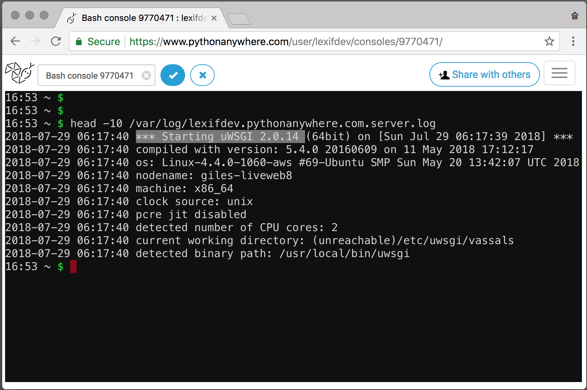

두번째 장고걸스 워크샵 A/S 입니다.

### Q. 왜 pythonanywhere 에서는 runserver를 하지 않았는데도 사이트에 들어가지나요?

이걸 이해하기 위해서는 먼저 django app과 서버는 독립적이라는 점을 먼저 이해해야 합니다.
python manage.py runserver는 서버를 돌리기 위한 여러 방법 중에 하나 이고
django app을 돌리는 방법은 여러가지가 있습니다.

지금까지와는 다르게 한번 gunicorn 이라는 서버로 django를 돌려보겠습니다.
```
pip install gunicorn
gunicorn -b :8000 djangogirls.wsgi:application
```


runserver를 이용해 서버를 띄웠을 때와 마찬가지로 127.0.0.1:8000 으로 접속이 가능한걸 볼 수 있습니다.

이번에는 uwsgi 라는 서버로 django를 돌려보겠습니다.
```
pip install uwsgi
uwsgi --http :8000 --module djangogirls.wsgi:application
```


마찬가지로 잘 들어가지는것을 확인할 수 있습니다.

pythonanywhere는 바로 이 uwsgi를 이용해 서버를 돌리고 있습니다.
우리가 실행 시킨적은 없었지만 pythonanywhere는 기본적으로 uwsgi를 항상 켜두고 있습니다.
이는 pythonanywhere의 서버 로그를 통해 확인할 수 있습니다.




### 왜 pythonanywhere 는 runserver대신 uwsgi를 쓰나요?

django는 [실제 서비스에서 runserver를 쓰지 말 것을 권고](https://docs.djangoproject.com/ko/2.1/ref/django-admin/#runserver) 하고 있습니다.


runserver는 개발을 편하게 하는데 중점을 두고 개발된 서버 입니다. 그래서 속도도 느리고 보안도 뛰어나지 않습니다.


서버들의 간단한 성능 비교. (초당 요청 수. 높을수록 좋음.)

| 서버 종류    | 동시 1연결 | 동시 10 연결 | 동시 20 연결 |
|-----------|--------:|----------:|---------:|
| runserver |  282.64 |    309.96 |    Error | 
| gunicorn  |  303.72 |   1069.58 |  1399.85 |
| uwsgi     |  406.46 |   1024.38 |  1303.43 |

runserver 로는 많은 사람이 동시에 접속하는 경우 제대로 페이지를 보여주지 못할겁니다.


### 왜 pythonanywhere 에서는 코드를 수정하고 나서 reload가 필요한가요?

django app도 일종의 프로그램으로 실행하는 시점의 코드로 컴퓨터 메모리에 올라갑니다.
바뀐 코드로 동작하도록 하려면 기존 프로그램은 끄고 새로 프로그램을 실행하는 과정이 필요합니다.

사실은 runserver도 reload가 필요합니다. 다만 이 과정을 자동으로 해주고 있었을 뿐입니다.
runserver는 파일들을 감시하고 있다가 파일의 내용이 수정되면 서버를 재시작 합니다.

아래 영상에서 파일을 저장할 때 마다 서버가 다시 시작되는 모습을 보실 수 있습니다.
 


하지만 이 파일을 감시하는 과정이나 재시작 하는 과정이 느리고 컴퓨터에 부하를 주기 때문에
파일이 자주 바뀔일이 없는 실서버에서는 파일 감시나 자동 재시작을 하지 않는 것이 성능에 유리합니다.
그래서 gunicorn이나 uwsgi 같은 실서비스를 위한 서버들은 기본적으로 자동 재시작을 하지 않도록 설정되어있습니다. 

이 설정은 pythonanywhere에서도 마찬가지여서 pythonanywhere에서는 파일을 수정하고 나면 서버를 수동으로 재시작 해야 합니다.


---
> TMI WARNING : 여기서 부터는 알 필요 없는 내용을 다루고 있습니다.

## 그런데 이 wsgi는 뭔가요?

django app을 수정하지 않고 서로 다른 서버를 사용한 것을 눈치 채셨을겁니다.
이는 django app과 서버들이 모두 [wsgi](https://www.python.org/dev/peps/pep-0333/)라는 같은 표준을 따랐기 때문입니다.

wsgi는 django 같은 파이썬 웹 프레임워크가 서버와 데이터를 주고 받는 방식 중 가장 널리 쓰이는 표준 방법입니다.
pythonanywhere의 ~~pythonanywhere_wsgi.py 파일을 열면 다음과 같은 application 함수를 볼 수 있었을겁니다.
```python
def application(environ, start_response):
   ...
```

이 application 함수는 우리가 호출하는게 아니라 gunicorn 같은 서버가 호출하는 함수 입니다.
우리는 이 application 함수의 내용을 채워넣어 서버가 적절한 내용을 보내주도록 할 수 있습니다.

application 함수를 다음과 같이 바꾸면 웹 브라우저에서 어떤 주소를 넣어도 'Hello' 라는 글자만 볼 수 있을겁니다.
```python
def application(environ, start_response):
   start_response('200 OK', [('Content-Type', 'text/html')])
   return [b'<h1>Hello</h1>']
```


그리고 environ 이라는 인자에 요청한 페이지 경로, 페이지 변수 같은 브라우저의 요청 사항이 담겨져 옵니다.
다음의 application 함수로 이를 확인할 수 있습니다.
```python
def application(environ, start_response):
   content = ''
   for k, v in environ.items():
       content += k
       content += ': '
       content += str(v)
       content += '\n'
   start_response('200 OK', [('Content-Type', 'text/plain')])
   return [content.encode('utf8')]
```


(6번째 PATH\_INFO와 첫줄의 QUERY\_STRING을 유심해서 보세요)

이 environ의 값을 읽어 적절한 페이지를 생성하는것이 웹 프로그램의 역할이고
이것을 좀 더 편하게 해주는것이 django 같은 웹 프레임워크의 역할입니다.
