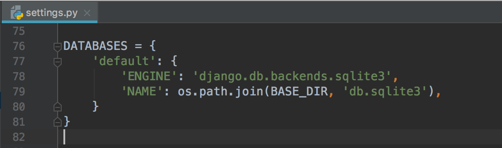
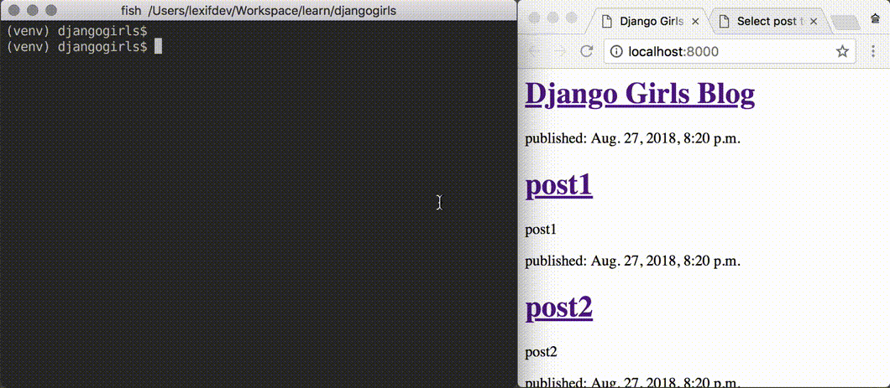
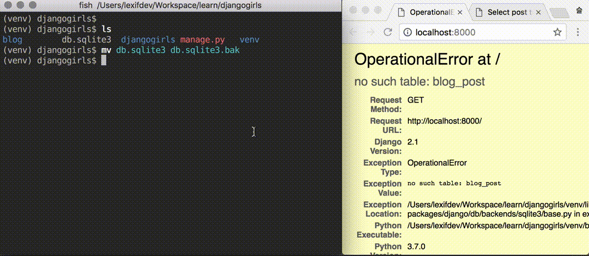
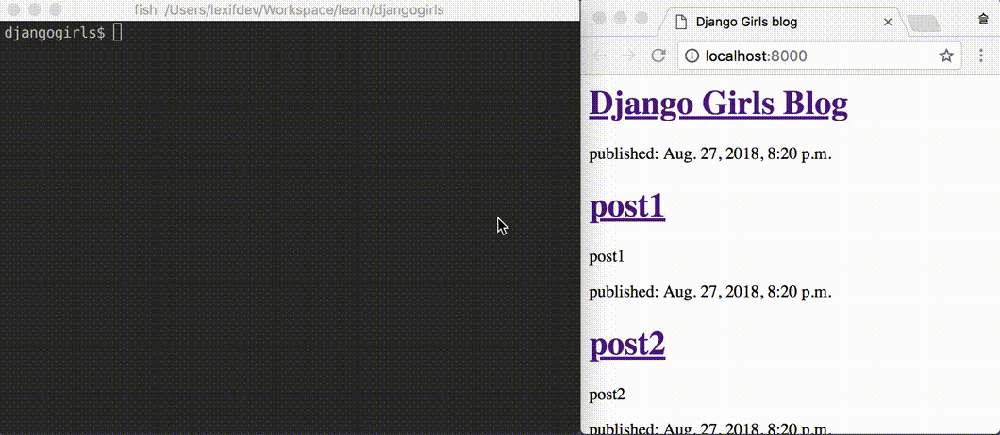
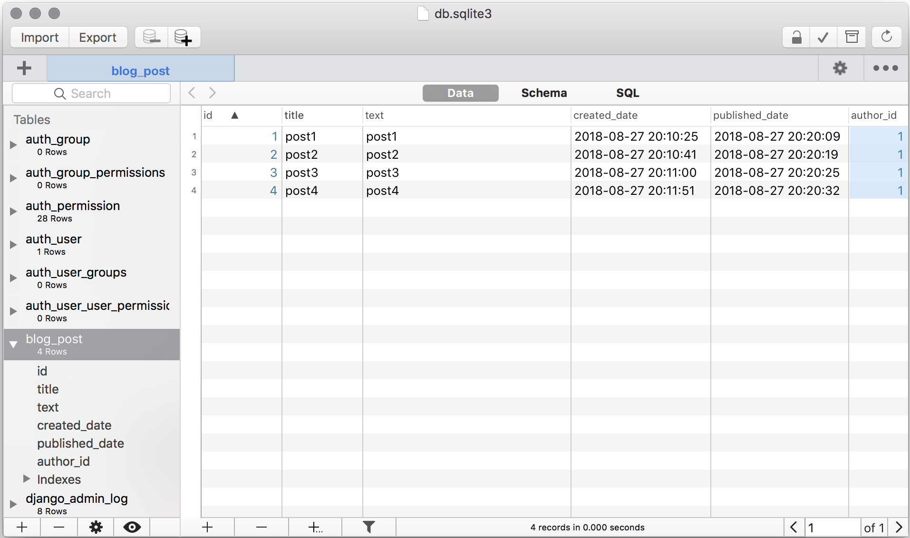
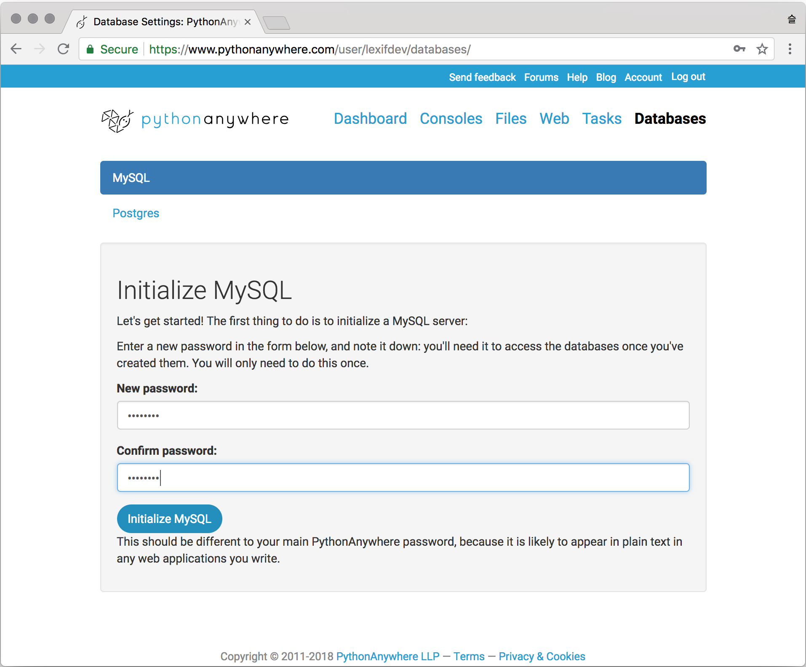
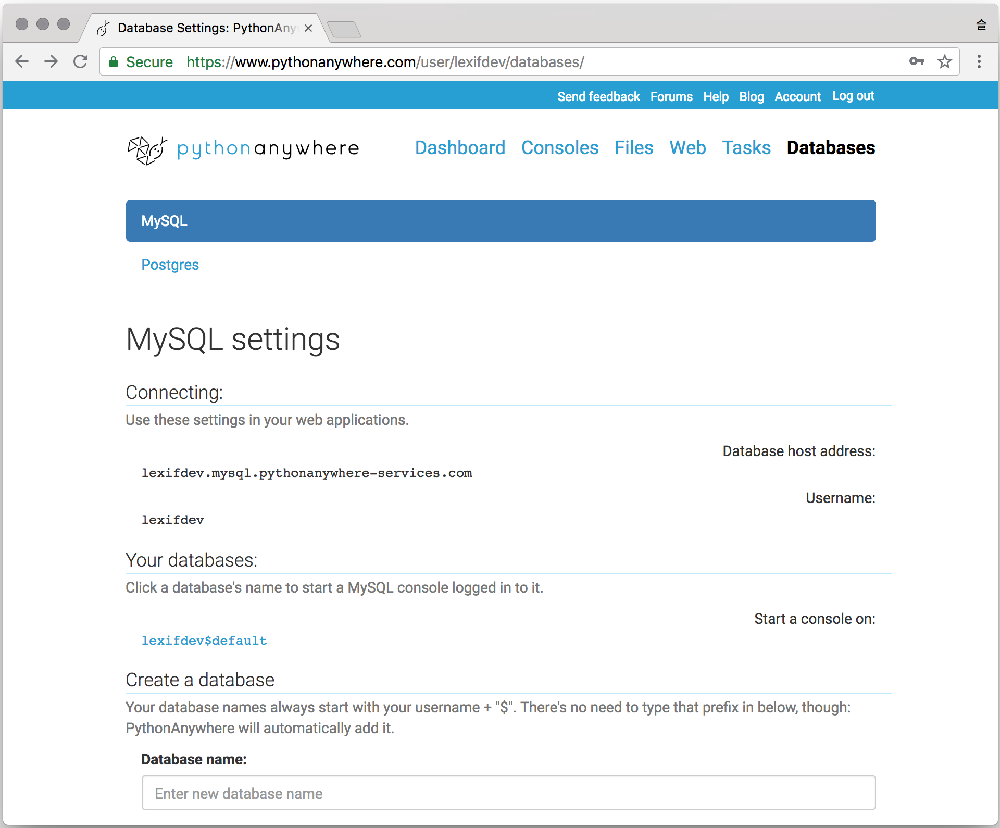
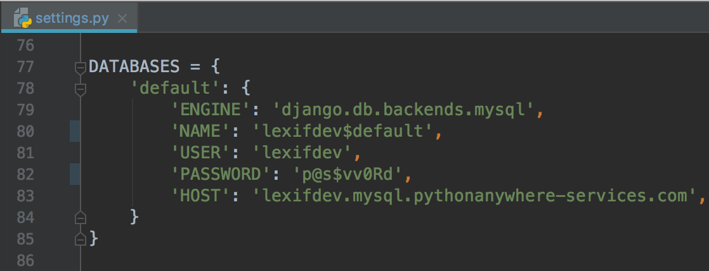

사실 세상의 거의 대부분의 웹사이트는 데이터 뷰어 라고 볼 수 있습니다.

블로그라면 글이,
서점이라면 책이,
쇼핑몰이라면 상품이 데이터가 될겁니다.
그리고 주문, 예약, 취소 같은 행위들도 데이터로 표현할 수 있습니다.

이러한 데이터들을 체계적으로 저장해둔것을 데이터베이스라고 합니다.

그리고 데이터베이스는 '데이터베이스 관리 시스템(DBMS)' 이라고 부르는 프로그램을 통해 데이터를 넣거나, 찾거나, 변경하거나, 삭제할 수 있습니다. (CRUD)  

DBMS의 종류는 매우 다양하지만 django는 그 중에서 SQLite라고 하는 DBMS를 기본 설정으로 사용하고 있습니다.
SQLite는 별도로 설치하거나 서버를 띄울 필요가 없어 사용이 간단하다는 장점이 있습니다. 

settings.py 파일상의 기본 설정. 엔진으로는 SQLite을 사용하고 저장될 파일의 이름은 'db.sqlite3'인 것을 볼 수 있습니다.

migrate를 하면 앞서 설정에 지정된대로 'db.sqlite3' 파일이 생성되는걸 볼 수 있습니다. 바로 이 파일에 우리의 블로그 글이 저장 됩니다.

이 파일을 삭제하거나 다른곳으로 옮기면 웹사이트는 들어가지지 않고 오류가 발생할겁니다.

이 상태에서 다시 migrate 하여 db.sqlite3 파일을 생성하면 다시 웹사이트는 들어가지지만 이전에 추가한 글들은 사라져 있을겁니다.

바로 이게 우리가 pythonanywhere 서버에서 했던것과 동일한 작업입니다.
우리는 db.sqlite3 파일을 서버에 올리지 않았고 서버에서 새로 migrate 했습니다. 

### Q. 그럼 .sqlite3 파일을 서버로 옮기면 글들도 옮겨지나요?

네

---

> TMI WARNING : 여기서 부터는 굳이 알 필요 없는 내용을 다루고 있습니다.

### Q. .sqlite3 파일을 직접 열어볼 수 있나요?

이 파일을 일반 텍스트 에디터로 열어보면 곳곳이 깨져서 제대로 알아보기 어렵습니다.
이 파일은 일반적인 텍스트 파일이 아니기 때문입니다. 
 

이 파일은 텍스트 에디터가 아닌 전용 프로그램을 사용해서 열어야 합니다. [SQLite 공식 다운로드 페이지](https://www.sqlite.org/download.html)에서 sqlite-tools를 받으면
sqlite3 라는 실행파일이 들어있습니다. (Windows용은 sqlite3.exe)

그리고 이 프로그램을 이용하면 SQL 이라는 언어를 사용해 데이터를 불러오거나 저장할 수 있습니다. SQL은 많은 DBMS들이 지원하고 있는 DBMS 전용 언어입니다.

사실은 sqlite3 파일을 열 수 있는 GUI 프로그램도 있습니다.

장고는 내부적으로 python 코드를 SQL로 변환하여 실행하는 구조로 되어있습니다.  

---

> TMI WARNING : 여기서 부터는 몰라도 되지만 알면 좋은 내용을 담고 있습니다.

대부분의 개인 수준의 웹사이트는 SQLite 로도 충분합니다.
하지만 동시에 데이터를 쓰는 사용자가 많아진다면 SQLite와 같은 파일형 DBMS로는 감당하기 어렵습니다.
이럴때는 확장이 용이한 독립 서버 형태의 DBMS를 사용해야 합니다. 

이러한 대표적인 DBMS로는 MySQL이 있습니다. MySQL은 Facebook, Twitter 등에서도 사용중입니다.
실제 서비스를 운영할 생각이라면 SQLite보다는 MySQL이 나은 선택이 될겁니다.   

pythonanywhere는 이 MySQL을 지원합니다.
pythonanywhere에서 MySQL을 쓰기 위해서는 먼저 초기화 과정이 필요합니다. 
Database 탭에서 사용할 암호를 지정하고 Initialize MySQL 버튼을 누르면 초기화가 진행됩니다.

MySQL이 초기화 되고 나면 다음 같은 화면을 볼 수 있을겁니다. 

그리고 장고에서 settings.py 의 DATABASE 값을 이전 화면을 참고하여 넣어주면 이제부턴 SQLite 대신 MySQL을 사용하게 됩니다.  
 
